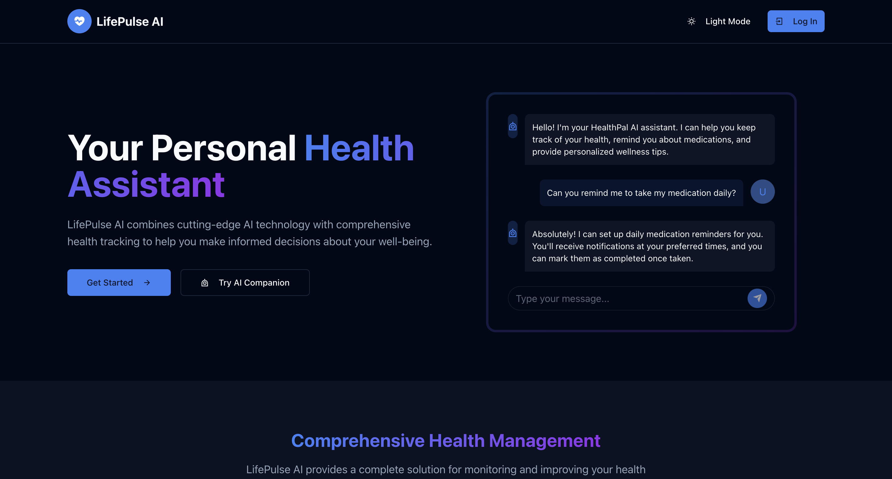
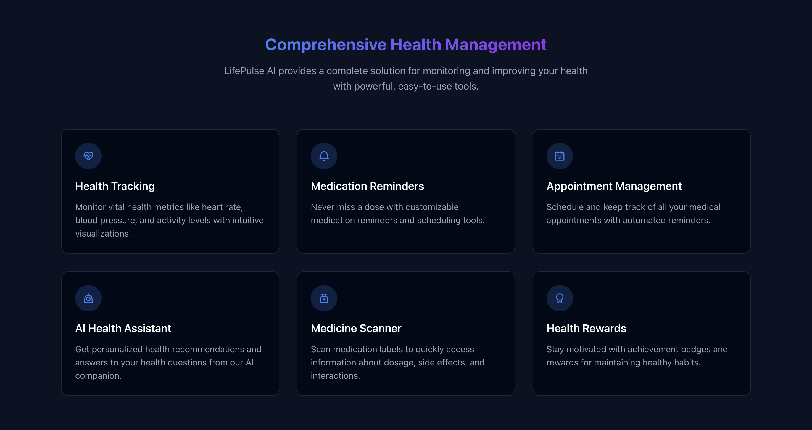
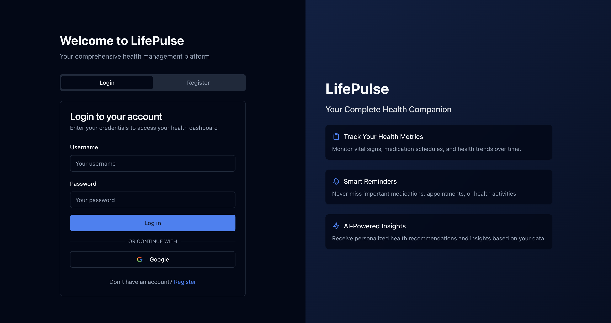
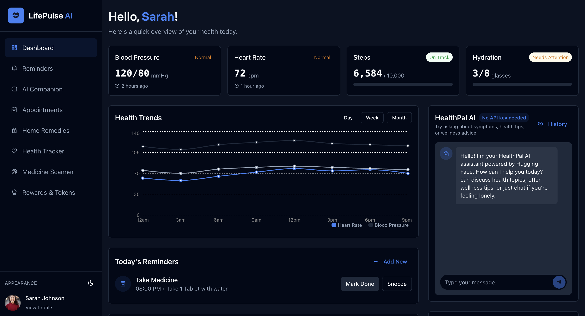

# LifePulse-AI
LifePulse AI - Your Smart Companion for a Healthier Tomorrow!


---

## Table of Contents

- [Overview](#overview)
- [Features](#features)
- [Tech Stack](#tech-stack)
- [Installation & Setup](#installation--setup)
- [Visuals & Demo](#visuals--demo)
- [Contributors](#contributors)

---

## Overview

LifePulse AI is an AI-powered health monitoring and wellness management platform designed to:
- **Track your health:** Monitor vital signs such as blood pressure, heart rate, step count, and ECG readings.
- **Engage and support:** Chat with an AI companion for friendly support and basic health advice.
- **Manage your schedule:** Keep track of daily reminders, doctor appointments, and home remedy suggestions.
- **Reward healthy habits:** Earn tokens, badges, and trophies that can be redeemed for discounts on healthcare services.

The platform features a dynamic landing page, intuitive user authentication, and a responsive design that supports both light and dark modes.

---
## Visuals & Demo
**Landing Page**


---
**Login Page**

---
**DashBoard Page**

---

---
## Features

- **Dashboard Overview:**  
  - Today's Reminders, Upcoming Appointments, and real-time health stats (BP, heart rate, steps, ECG).
  - Animated notifications for drinking water, taking medications, and more.

- **AI-Powered Chatbot:**  
  - A friendly AI companion to provide conversation, emotional support, and health advice.
  - Integrated mood tracking and conversation history.

- **Reminders & Appointments:**  
  - Create, edit, and delete reminders with proper date validations.
  - Schedule and manage doctor appointments seamlessly.

- **Health Tracker:**  
  - Visual dashboards with interactive graphs showing historical health data.
  - Dummy data integration for demo purposes, with an option to connect real wearable devices.

- **Medicine Scanner:**  
  - Scan medicine labels to retrieve dosage, usage instructions, side effects, and warnings.
  - Error handling for missing API keys with clear user instructions.

- **Rewards & Gamification:**  
  - Earn tokens and unlock badges/trophies based on daily streaks and healthy habits.
  - Animated feedback for successful reward redemption.

- **Dynamic Landing Page:**  
  - Interactive 3D models using libraries like Three.js.
  - Clean signup/sign-in pages with email/password and Google OAuth integration.

- **Light/Dark Mode Toggle:**  
  - Switch between light and dark themes for enhanced user experience.
  - Preference persistence across sessions.

---

## Tech Stack

- **Frontend:** React.js, TailwindCSS 
- **Backend:** Node.js, Express.js
- **Database:** MongoDB
- **AI & APIs:** OpenAI API, third-party AI services
- **Authentication:** Firebase, Google OAuth
- **Visualization:** Chart.js, D3.js, or Recharts for interactive graphs
- **Deployment:** Vercel/Netlify for frontend, AWS/Render for backend

---

## Installation & Setup

### Prerequisites
- Node.js (v14 or higher)
- npm or yarn
- MongoDB instance (local or cloud)
- Firebase account for authentication
- Valid API keys for OpenAI and other integrated services

### Steps

1. **Clone the Repository**
   ```bash
   git clone https://github.com/your-repo/lifepulse-ai.git
   cd lifepulse-ai
   ```
2. **Installation & Setup**

Install Dependencies

#### For Frontend:
```bash
  cd frontend
  npm install
```
#### For Backend:
```bash
cd ../backend
npm install
```

3. **Configure Environment Variables**
  Create a .env file in the root directory and add:
```bash
# Frontend
REACT_APP_OPENAI_API_KEY=your_openai_api_key
REACT_APP_FIREBASE_CONFIG=your_firebase_config

# Backend
MONGO_URI=your_mongodb_uri
PORT=5000
```
4. **Run the Application**

Start the backend server:
```bash
cd backend
npm run dev
```
Start the frontend server:
```bash
cd ../frontend
npm start
```
Access the Application Open your browser and navigate to http://localhost:3000.

## Contributors
- Arpita Nanda
- K Dheeraj
- Nitya Mishra
- Saurav Kumar Pandey

⭐ Thank you for checking out LifePulse AI! If you like our project, please give it a star! ⭐
